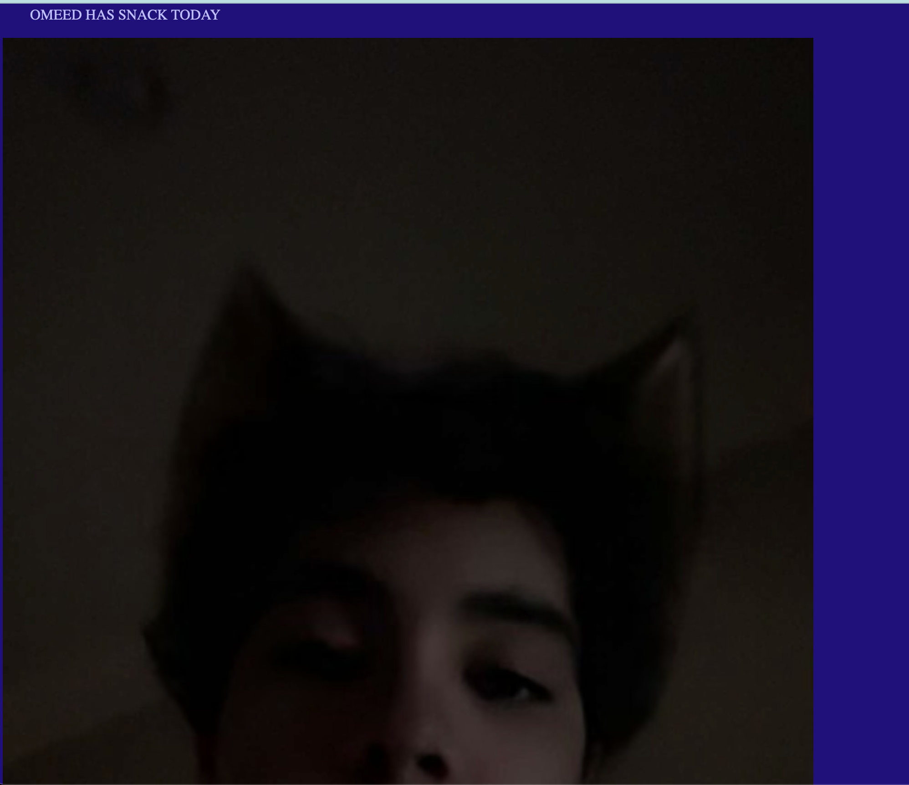

# Resume:
<h2><a href="https://happy-mario.github.io/side" target="_blank">Link to my side projects </a></h2>

<h3><a href="https://github.com/happy-mario/happy-mario.github.io/tree/main" target="_blank">My One Tap Quest Bot Project:</a></h3>

#### My first GitHub project, just a silly little thing I hope someone uses 
<h3><a href="https://github.com/happy-mario/Advisory_Email-Website_Bot/blob/main/README.md" target="_blank">Work in progress!! Advisry snack bot:</a></h3>

### My second email bot:
#### this is going to send an email to the person in my school advisory that has to bring in snack on the day they have snack. I am using smptplib for the email and im not entirely sure what im doing for the whole name part. 
### Update 1: 
#### got the email stuff workn' n dat right but like the 'ole bliming people part is not up workn' init. I'm going to set the name variable to be the person's name so it makes it easier for me, as I will use the same variable to send the email.
### Update 2: The email bot works so i have started on the website part. With help i was able get flask working so i have a website. Using some of my old code I have set the variable so if i go on the website i can see whose snack it is, but others can not. So, i have to set up the website itself
### Update 3: It is finished, but getting it on to a domain is very dificult and I have a deadline, so that is a project for another time. Attached below is a picture of what the website looks like.

